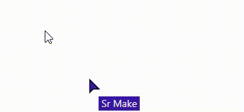
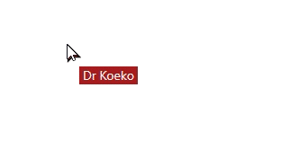

# LiveCursor

## Overview

This is a follow up to Koen van Gilst's great blog post [Phoenix LiveView Cursors](https://koenvangilst.nl/blog/phoenix-liveview-cursors) which walks you through the process of adding cursors for the visitors on page using LiveView and Phoenix Presence. Be sure to read it before continuing here, this builds upon what you'll make there.

The tutorial does a **great** job at delivering a working feature and teaching you along the way, but it felt like one additional step in the journey was missing -- improving the local users mouse responsiveness.

## The Problem

With the implementation at the end of Koen's tutorial we end up with all users sending their position to the server and the LiveView rendering each mouse with a custom SVG, their name, and chat message.

The ping pong of sending your mouse position to the server and waiting for it to be processed and sent back to you takes time. 

It's perfectly acceptable for the other users cursors to be slightly behind their actual position, but when applied to your own cursor the slight lag leaves you feeling like your mouse is covered in peanut butter.



We can make the issue clear by adding 100ms of simulated latency to the LiveView. By rendering both the default local cursor along with your LiveView synced cursor we can see that the networked cursor lags behind the actual mouse position.

 In the final app the default cursor is hidden and you can **only** see the LiveView synced cursor, so with enough latency this sluggishness renders the mouse nearly unusable.

## Solutions

One simple solution is simply to only render other users cursors using LiveView, leaving your users native cursor untouched. In this example, as the cursors look dramatically different and have a name/text floating next to them, this would not be an option.

In this solution we render the users cursor independently of the other networked cursors, instead relying on a **bit** of client side JavaScript and the glory of CSS variables to modify the rendered cursors position.

## How

The heart of the cursor tracking solution presented in Koen's post relies on tracking the `'mousemove'` event in a JavaScript hook, pushing the mouses position to the server:

```js
document.addEventListener('mousemove', (e) => {
    const x = (e.pageX / window.innerWidth) * 100; // in %
    const y = (e.pageY / window.innerHeight) * 100; // in %
    this.pushEvent('cursor-move', { x, y });
});
```

In order to control our local cursor from the client side we save our mouse position into two new [CSS variables](https://developer.mozilla.org/en-US/docs/Web/CSS/Using_CSS_custom_properties), `--x` and `--y`.

```js
document.documentElement.style.setProperty("--x", `${x}%`);
document.documentElement.style.setProperty("--y", `${y}%`);
```

The beauty of CSS variables is that they can be referenced in our cursor positions, allowing us to use the latest and greatest coordinates when rendering our local cursor!

In the tutorial example we loop through each user in our assigns and render their custom cursor.

```heex
<%= for user <- @users do %>
    <li style={"left: #{user.x}%; top: #{user.y}%"}
		...
    >
...
```

When rendering the cursors we can check if the cursor is the local user and ignore the `x` and `y` positions sent by the server, instead using our local `--x` and `--y` CSS variables as our coordinates to use the absolute latest mouse position.

```heex
<% is_local_user = user.socket_id == @socket.id %>
<% x = if is_local_user, do: "var(--x)", else: "#{user.x}%" %>
<% y = if is_local_user, do: "var(--y)", else: "#{user.y}%" %>
<li style={"left: #{x}; top: #{y}"}
    ...
>
```




Voila! Now our local mouse is being tracked in real time, even with 100ms of simulated latency.

Nice.

Now all we need to do is put our `cursor-none` back in to hide our default cursor and we've got a custom, multi-user, LiveView mouse that still feels perfectly responsive! 

## Remaining Issues

We may have solved The Case of the Cumbersome Comatose Cursor but we're not done yet!

The mouse position is based on the percentage across the screen it's at -- and that isn't going to be the same for all users. Some users will have their window narrow and others may be viewing it full screen on an ultra-wide monitor! Unless users have their browser at the exact same size, there are going to be inconsistencies on where other users mice appear versus reality.

That won't do.

Next time we'll work on changing our mouse position logic to be independent of screen size!

## Running the example project

To start your Phoenix server:

  * Run `mix setup` to install and setup dependencies
  * Start Phoenix endpoint with `mix phx.server` or inside IEx with `iex -S mix phx.server`

Now you can visit [`localhost:4000`](http://localhost:4000) from your browser.

## Learn more

  * Koen van Gilst's Phoenix LiveView Cursors: https://koenvangilst.nl/blog/phoenix-liveview-cursors
  * Official website: https://www.phoenixframework.org/
